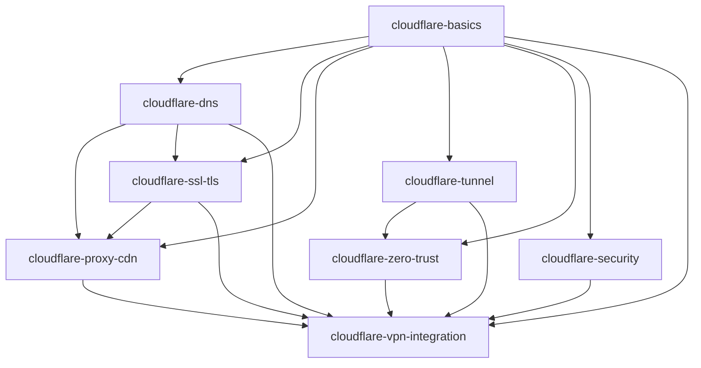

# cloudflare-skills

`cloudflare-skills` — самостоятельный skill-пакет для Codex по работе с Cloudflare в сценариях доменов, DNS, CDN, SSL/TLS, Cloudflare Tunnel, Zero Trust, Nginx Proxy Manager, homelab и VPN-инфраструктуры.

## Обзор проекта

- Все материалы написаны на русском языке.
- Используются только официальные источники Cloudflare.
- Если Cloudflare изменила терминологию или продуктовые границы, приоритет всегда у текущей официальной документации.
- Если данных из официальной документации недостаточно, skill должен явно сказать об ограничении и не выдумывать настройки.

Пакет предназначен для:

- проектирования архитектуры публикации через Cloudflare;
- безопасной работы с DNS, Proxy/CDN и SSL/TLS;
- выбора между `Proxied`, `DNS only`, `Tunnel` и `Zero Trust`;
- интеграции Cloudflare с origin reverse proxy, homelab и VPN-сценариями;
- построения рекомендаций только на официальной документации Cloudflare.

## Official Sources

Канонические категории источников:

- [Cloudflare Developer Documentation](https://developers.cloudflare.com/)
- [Cloudflare Learning Center](https://www.cloudflare.com/learning/)
- [Cloudflare DNS](https://developers.cloudflare.com/dns/)
- [Cloudflare SSL/TLS](https://developers.cloudflare.com/ssl/)
- [Cloudflare Tunnel](https://developers.cloudflare.com/tunnel/)
- [Cloudflare One / Zero Trust](https://developers.cloudflare.com/cloudflare-one/)
- [Cloudflare WAF](https://developers.cloudflare.com/waf/)
- [Cloudflare Rules](https://developers.cloudflare.com/rules/)
- [Cloudflare Cache](https://developers.cloudflare.com/cache/)

## Repository Tree

```text
cloudflare-skills/
├── README.md
├── LICENSE
├── SKILL_INDEX.md
├── cloudflare-basics/
│   ├── SKILL.md
│   ├── agents/
│   └── references/
├── cloudflare-dns/
├── cloudflare-ssl-tls/
├── cloudflare-proxy-cdn/
├── cloudflare-tunnel/
├── cloudflare-zero-trust/
├── cloudflare-security/
└── cloudflare-vpn-integration/
```

## Skill Tree

- `cloudflare-basics`
  Базовая архитектура Cloudflare: edge, origin, Anycast, reverse proxy, `Proxied` и `DNS only`.
- `cloudflare-dns`
  DNS records, proxy status, DNSSEC и публикация доменов.
- `cloudflare-ssl-tls`
  SSL/TLS modes, edge certificates, Origin CA и origin-side TLS.
- `cloudflare-proxy-cdn`
  Standard Cloudflare Proxy/CDN, cache behavior, headers, ports и WebSocket.
- `cloudflare-tunnel`
  `cloudflared`, public hostname, private network routing и outbound-only publication.
- `cloudflare-zero-trust`
  Access, policies, identity providers, Cloudflare One Client, WARP и service tokens.
- `cloudflare-security`
  WAF, custom rules, rate limiting, bot-related protection и DDoS protection.
- `cloudflare-vpn-integration`
  Cloudflare-side интеграция с OpenWrt, sing-box, 3x-ui, Nginx Proxy Manager и homelab.

## Dependency Map



## Recommended Reading Order

1. `cloudflare-basics`
2. `cloudflare-dns`
3. `cloudflare-ssl-tls`
4. `cloudflare-proxy-cdn`
5. `cloudflare-tunnel`
6. `cloudflare-zero-trust`
7. `cloudflare-security`
8. `cloudflare-vpn-integration`

## Dependencies

- `network-fundamentals`
- `cloudflare-skills`

## Политика источников

Во всех разделах список официальных источников хранится в `references/sources.md` внутри каждого skill-каталога.
